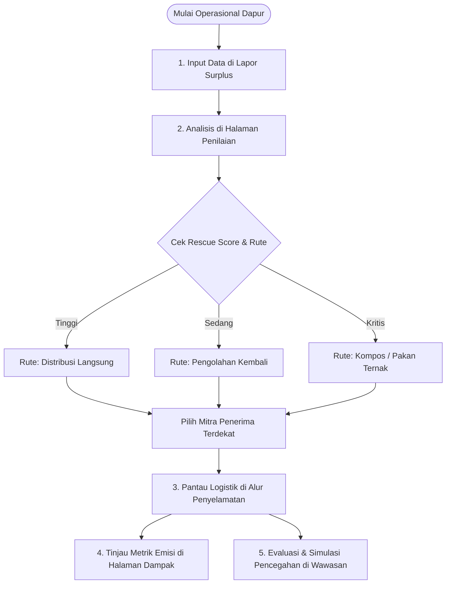

# 🍽️ REPLATE — Give Surplus Food Another Route

<p align="center">
  
  
  
  
  
  
</p>

<p align="center">
  <b>🌐 Live Website:</b> <a href="https://replate-omega.vercel.app" target="_blank">https://replate-omega.vercel.app</a><br/>
  <b>📦 GitHub Repository:</b> <a href="https://github.com/rohmatulloh-pixel/replate" target="_blank">https://github.com/rohmatulloh-pixel/replate</a>
</p>

---

## 📖 Tentang REPLATE

> **"Food should move. Not waste."**  
> *(Makanan harus bergerak, bukan terbuang.)*

**REPLATE** adalah platform manajemen dan penyelamatan surplus pangan cerdas (*Intelligent Food Surplus Routing & Upstream Prevention Platform*). Platform ini dirancang untuk menjembatani bisnis F&B, hotel, katering, restoran, dan penyelenggara acara dengan ekosistem penyelamatan makanan (bank makanan, panti asuhan, dapur sosial, dan pengolah kompos).

REPLATE tidak hanya membantu menyalurkan makanan berlebih ke hilir, tetapi juga menganalisis pola surplus berulang agar pelaku usaha dapat **mencegah pemborosan di hulu (*upstream prevention*)**, menghemat anggaran operasional dapur, dan menekan emisi gas rumah kaca.

```text
SURPLUS LAPORAN ➔ PENILAIAN SKOR ➔ RUTE HIERARKI ➔ REKOMENDASI MITRA ➔ PELACAKAN LOGISTIK ➔ DAMPAK ESG & WAWASAN
```

---

## ⚠️ Permasalahan yang Dihadapi (Problem Statement)

1. **Paradoks Sampah Pangan Indonesia:**
   * Indonesia membuang **23–48 juta ton makanan per tahun** (Kajian Bappenas). Kerugian ekonomi mencapai lebih dari Rp 200–550 triliun per tahun.
   * Di saat yang sama, jutaan masyarakat masih menghadapi kerentanan gizi dan stunting.
2. **Keterbatasan Waktu & Kebingungan Dapur (*Shelf-Life Crisis*):**
   * Makanan siap santap memiliki masa simpan kritis (beberapa jam sebelum basi).
   * Restoran dan katering sering kali tidak memiliki saluran distribusi cepat, sehingga opsi tercepat yang diambil adalah langsung membuangnya ke TPA.
3. **Krisis Iklim dari Gas Metana ($CH_4$):**
   * Makanan organik yang membusuk di TPA tanpa oksigen menghasilkan gas metana, yang memiliki potensi pemanasan global puluhan kali lipat lebih agresif daripada $CO_2$.
4. **Tanpa Evaluasi Pencegahan (*Over-Ordering* Berulang):**
   * Dapur komersial sering mengalami kelebihan porsi yang sama berulang kali karena tidak memiliki data analitik untuk memperbaiki perencanaan belanja bahan baku.

---

## ✨ Fitur-Fitur Utama Platform

### 1. 🏠 Beranda Interaktif (*Home*)
* Ringkasan visi, indikator cepat, dan visualisasi alur hierarki penyelamatan makanan (*Food Recovery Hierarchy*).
* Navigasi instan menuju pelaporan surplus.

### 2. 📝 Lapor Surplus Cepat (*Report Surplus*)
* Formulir input cerdas dengan preset siap pakai (contoh: *Nasi Kotak Katering*, *Sayuran Segar*, *Roti Sisa Toko*).
* Pencatatan parameter keamanan pangan: jenis makanan, kuantitas/satuan, sisa jam layak aman, kondisi kemasan, status suhu penyimpanan, dan konteks kegiatan asal.

### 3. ⚖️ Penilaian Cerdas & Algoritma Rescue Score (*Assessment*)
* **Algoritma Rescue Score (0–100):** Mesin penilaian deterministik tanpa halusinasi yang mengukur viabilitas pangan berdasarkan sisa waktu, higienitas kemasan, dan stabilitas suhu.
* **Penentuan Rute Hierarki Otomatis:**
  * 🟢 **Distribusi Langsung:** Penyaluran makanan siap konsumsi ke bank makanan, panti, atau komunitas.
  * 🟡 **Pengolahan Kembali (*Repurpose*):** Transformasi bahan baku/sayuran menjadi hidangan baru bernilai tambah di dapur sosial.
  * 🟠 **Diversi Organik (Pakan Ternak / Kompos):** Penanganan biologis yang aman saat makanan sudah melampaui batas konsumsi manusia.
* **Pencocokan Mitra Cerdas (*Smart Partner Matching*):** Menyarankan mitra terdekat dengan mempertimbangkan radius jarak, kapasitas penampungan, dan kecepatan respons penjemputan.

### 4. 🚚 Alur Pelacakan Logistik (*Journey & Custody Tracking*)
* Memantau status penanganan makanan surplus secara bertahap:
  1. *Menunggu Konfirmasi*
  2. *Mitra Ditugaskan*
  3. *Dalam Penjemputan / Logistik*
  4. *Berhasil Disalurkan & Terselamatkan*
* Antarmuka interaktif untuk memperbarui status pengiriman secara transparan.

### 5. 🌍 Kalkulator Dampak Nyata (*Impact & ESG Analytics*)
* Mengonversi surplus makanan yang terselamatkan menjadi indikator metrik nyata:
  * **Kilogram Pangan Terselamatkan**
  * **Porsi Makanan Terpenuhi** (standar GFN: 0.35 kg/porsi)
  * **Emisi $CO_2e$ yang Dicegah** (metodologi US EPA WARM: 2.5 kg $CO_2e$/kg makanan)
  * **Nilai Ekonomi Rupiah (Rp)** yang diselamatkan dari pemborosan.
  * **Ekuivalensi Lingkungan:** Setara pohon yang ditanam dan energi listrik yang dihemat.

### 6. 💡 Wawasan Operasional & Simulator Pencegahan (*Insights & Prevention*)
* **Deteksi Pola Surplus Berulang:** Mengidentifikasi jenis makanan yang paling sering sisa dan kegiatan/acara yang menjadi sumber utama.
* **Rekomendasi Pencegahan Otomatis:** Menghasilkan saran operasional konkret bagi tim manajemen dapur untuk memperbaiki perencanaan pembelian bahan baku.
* **Simulator Pengurangan Limbah (*Prevention Simulator*):** Slider interaktif untuk mensimulasikan pemotongan kelebihan belanja (5%–30%) dan langsung melihat potensi efisiensi biaya dan kilogram limbah yang dicegah sebelum dimasak.

### 7. 🌐 Fitur Aksesibilitas & Arsitektur
* **Dukungan Multi-Bahasa Lengkap (Bilingual ID 🇮🇩 / EN 🇬🇧):** Switch instan satu klik dengan ikon bendera di semua halaman.
* **Local-First (Zero-Login):** Data tersimpan langsung dan aman di `localStorage` peramban. Sangat cepat, privat, dan siap didemokan tanpa memerlukan database eksternal.
* **Desain Responsif:** Tampilan optimal di perangkat smartphone, tablet, maupun layar laptop/desktop.

---

## 🛠️ Alur Penggunaan (User Workflow)



---

## 📁 Struktur Direktori Proyek

```text
replate/
├── public/                 # Favicon dan aset statis SVG
├── src/
│   ├── assets/             # Ilustrasi & logo
│   ├── components/         # Komponen UI modular
│   │   ├── Button.jsx              # Tombol kustom bervariasi
│   │   ├── EmptyState.jsx          # Tampilan saat data kosong
│   │   ├── ErrorBoundary.jsx       # Penangkal error runtime
│   │   ├── Footer.jsx              # Footer gelombang modern
│   │   ├── JourneyTimeline.jsx     # Garis waktu status logistik
│   │   ├── MatchCard.jsx           # Kartu rekomendasi mitra
│   │   ├── Navbar.jsx              # Navigasi melayang + selector bahasa
│   │   ├── PreventionSimulator.jsx # Simulator pencegahan surplus
│   │   ├── ScoreBreakdown.jsx      # Visualisasi rincian skor
│   │   └── StatusBadge.jsx         # Badge status multi-warna
│   ├── data/               # Data benchmark, aturan, dan mitra
│   │   ├── destinations.js         # Daftar mitra penampung terverifikasi
│   │   ├── foods.js                # Kategori pangan & parameter keamanan
│   │   ├── learning.js             # Data panduan pencegahan pangan
│   │   ├── rules.js                # Aturan pembobotan rute
│   │   └── sources.js              # Kategori asal operasional
│   ├── engine/             # Mesin logika deterministik
│   │   ├── matchingEngine.js       # Algoritma pencocokan mitra
│   │   ├── rescueScore.js          # Kalkulator Rescue Score (0-100)
│   │   └── routeEngine.js          # Penentu rute hierarki pangan
│   ├── pages/              # Halaman utama aplikasi
│   │   ├── Assessment.jsx          # Halaman evaluasi & pilihan rute
│   │   ├── Home.jsx                # Halaman beranda
│   │   ├── Impact.jsx              # Dashboard dampak ESG & emisi karbon
│   │   ├── Insights.jsx            # Wawasan surplus & pencegahan hulu
│   │   ├── Journey.jsx             # Pelacakan alur penyelamatan
│   │   └── ReportSurplus.jsx       # Formulir pelaporan makanan berlebih
│   ├── utils/              # Modul utilitas
│   │   ├── calculations.js         # Perhitungan matematis dampak
│   │   ├── formatters.js           # Format mata uang & tanggal
│   │   ├── i18n.js                 # Kamus terjemahan Bahasa Indonesia & Inggris
│   │   └── storage.js              # Manajemen penyimpanan lokal (localStorage)
│   ├── App.jsx             # Komponen root aplikasi & state routing
│   ├── index.css           # Konfigurasi Tailwind & gaya global
│   └── main.jsx            # Titik masuk render React DOM
├── index.html              # Shell HTML & Google Fonts
├── package.json            # Daftar pustaka & skrip proyek
├── tailwind.config.js      # Konfigurasi palet warna & tipografi
├── vercel.json             # Konfigurasi routing SPA Vercel
└── vite.config.js          # Konfigurasi bundler Vite
```

---

## 🚀 Panduan Menjalankan Proyek secara Lokal

### Kebutuhan Sistem
* [Node.js](https://nodejs.org/) versi 18.0.0 atau lebih baru
* npm atau yarn / pnpm

### 1. Kloning Repositori
```bash
git clone https://github.com/rohmatulloh-pixel/replate.git
cd replate
```

### 2. Instalasi Dependensi
```bash
npm install
```

### 3. Jalankan Server Pengembangan
```bash
npm run dev
```
Buka peramban dan akses alamat:  
👉 **`http://localhost:5173/`**

### 4. Build untuk Produksi
```bash
npm run build
npm run preview
```

---

## 🛡️ Catatan Keamanan Pangan (*Food Safety Disclaimer*)

> **REPLATE menyediakan sistem pendukung keputusan algoritmik untuk redistribusi dan pencegahan surplus makanan. Platform ini tidak menggantikan inspeksi keamanan pangan langsung di lokasi atau standar sertifikasi higienitas resmi. Keputusan redistribusi makanan siap santap harus selalu mematuhi panduan dinas kesehatan dan regulasi keamanan pangan yang berlaku.**

---

## 📄 Lisensi
Didistribusikan di bawah lisensi **MIT License**.
Dikembangkan untuk masa depan rantai pasok pangan yang berkelanjutan dan bebas sampah.
